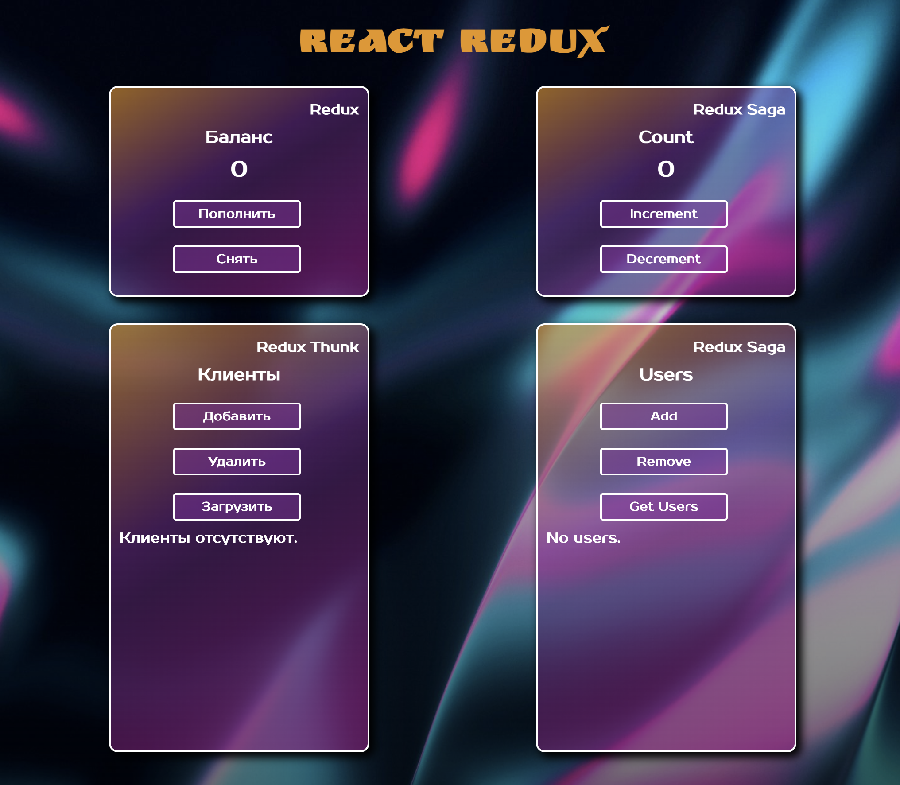

# React

#### Данное приложение реализовано с помощью JavaScript-библиотеки – React, с использованием библиотеки Redux и библиотеки React-redux.

          
<b>#</b> В ходе работы над приложением был создан стор&#40;
<b>store</b>&#41; с помощью функции <b>createStore</b> из <b>Redux</b>
. Создано 4 редьюсера&#40;<b>reducers</b>&#41;, которые принимают
предыдущее состояние&#40;<b>state</b>&#41; и экшен&#40;<b>action</b>
&#41;. Редьюсеры определяют, как изменится состояние приложения в
ответ на экшены, отправленные в стор. Редьюсеры были объединены в один
объект&#40;rootReducer&#41;, благодаря функции <b>combineReducers</b>,
а затем объект был передан в стор. Импортирован хук &#40;<b>useSelector</b>&#41;, для извлечения данных из состояния хранилища.
Хук &#40;<b>useDispatch</b>&#41; импортирован для получения функции
<b>dispatch</b> из <b>Redux</b>. Для удобства разработки и
отслеживания изменения состояния был установлен модуль
<b>redux-devtools-extension</b>, инструменты разработчика.
Импортированная функция <b>composeWithDevTools</b> из данного модуля
была передана вторым параметром в функцию <b>createStore</b>.
 
 
<b>#</b> Первый редьюсер &#40;<b>cashReducer</b>&#41; принимает
состояние баланса и обрабатывает следующие экшены: пополнение баланса
на заданную сумму &#40;ADD_CASH&#41; и снятие заданной суммы с
баланса&#40;GET_CASH&#41;.
 
 
<b>#</b> Второй редьюсер &#40;<b>customerReducer</b>&#41; принимает
состояние, которое содержит массив объектов&#40;клиентов&#41;, а также
обрабатывает следующие экшены: добавление
клиента&#40;ADD_CUSTOMER&#41;, удаление
клиента&#40;REMOVE_CUSTOMER&#41; и загрузку клиентов с
сервера&#40;ADD_MANY_CUSTOMER&#41;. Для все трех экшенов были созданы
генераторы экшенов&#40;action creators&#41;, для более удобного
использования. Загрузка клиентов с сервера осуществляется асинхронно с
помощью <b>middleware</b> библиотеки <b>Redux Thunk</b>. Для
подключения библиотеки <b>Redux Thunk</b> была импортирована функция
<b>applyMiddleware</b> из <b>Redux</b>. <b>Redux Thunk</b> позволяет
использовать <b>dispatch</b> внутри сторонних функций, принимая
<b>dispatch</b> параметром в функцию.
 
 
<b>#</b> Третий редьюсер &#40;<b>countReducer</b>&#41; принимает
состояние счетчика и обрабатывает следующие экшены: увеличение
счетчика на единицу&#40;INCREMENT&#41; и уменьшение счетчика на
единицу&#40;DECREMENT&#41;. Увеличение и уменьшение счетчика выполнено
как асинхронный процесс, в начале происходит задержка на одну секунда,
а затем счетчик увеличивается или уменьшиться. Данный функционал
реализован с помощью <b>middleware</b>-библиотеки <b>Redux Saga</b>.
Создано два воркера&#40; incrementWorker и decrementWorker&#41; и
вотчер &#40;countWatcher&#41; с помощью функции-генератор. Из
<b>Redux Saga</b> были импортированы два эффекта: <b>put</b> и
<b>takeEvery</b>. Для работы вотчера было создано 2 экшен генератора
&#40;AsyncCountIncrementAction и AsyncCountDecrementAction&#41;. Для
создания middleware saga была импортирована функция
<b>createSagaMiddleware</b>, вызываем функцию и передаем вторым
параметром в <b>applyMiddleware</b>. Создаем главный вотчер и с
помощью эффект функции <b>all</b> объединяем два вотчера
&#40;countWatcher и userWatcher&#41;. Затем запускаем созданную
middleware saga с помощью функции run и передаем в нее главный вотчер.
 
 
<b>#</b> Четвертый редьюсер &#40;<b>userReducer</b>&#41; принимает
состояние, которое содержит массив объектов(пользователей), а также
обрабатывает следующие экшены: добавление
пользователя&#40;ADD_USER&#41;, удаление
пользователя&#40;REMOVE_USER&#41; и загрузка пользователей с
сервера&#40;SET_USERS&#41;. Для все трех экшенов были созданы
генераторы экшенов&#40;action creators&#41;, для более удобного
использования. Загрузка пользователей с сервера осуществляется
асинхронно с помощью <b>middleware</b> библиотеки <b>Redux Saga</b>.
Создано воркер&#40;fetchUserWorker&#41; и вотчер&#40;userWatcher&#41;
с помощью функции-генератор. Из <b>Redux Saga</b> были импортированы
эффекта: <b>put</b>, <b>call</b> и <b>takeEvery</b>. Для работы
вотчера был создан экшен генератор &#40;fetchUsersAction&#41;.
 
 
<b>Вывод</b>: Использование стейт менеджера <b>Redux</b> в приложении
облегчает работу с состоянием, упрощает масштабирование и имеет
множество полезных инструментов. <b>Redux</b> часто используют в
связке с <b>React</b>, потому что в<b>React</b> не очень удобный
встроенный алгоритм для управления состояниями. Его особенности
приводят к тому, что приложение становится тяжело масштабировать.
<b>Redux</b> решает эту проблему. Для <b>Redux</b> существуют
вспомогательные библиотеки и инструменты, которые упрощают написание
кода.

#### _screenshot(1)_

### `npm start`

Runs the app in the development mode.
Open [http://localhost:3000](http://localhost:3000) to view it in your browser.